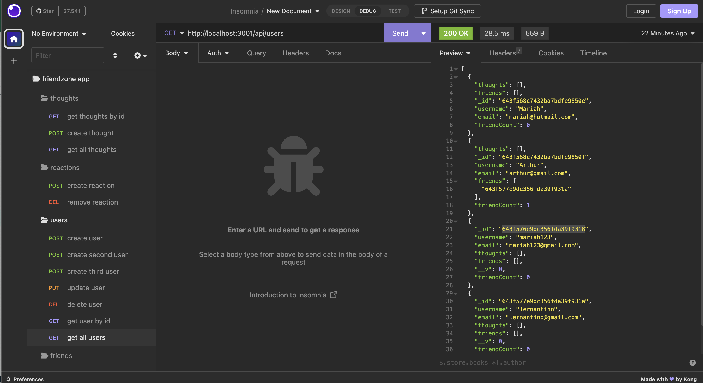

# 18-NoSQL-Social-Network-API

## Overview

 The challenge is to build an API for a social network web application where users can share their thoughts, react to friends’ thoughts, and create a friend list

## Table of contents

- [Overview](#overview)
  - [The challenge](#the-challenge)
  - [Screenshot](#screenshot)
  - [Links](#links)
- [My process](#my-process)
  - [Built with](#built-with)
  - [Usage](#usage)
- [Author](#author)

## The Challenge

### User Story (given in source code)

```md
AS A social media startup
I WANT an API for my social network that uses a NoSQL database
SO THAT my website can handle large amounts of unstructured data
```

### Acceptance Criteria (given in source code)

```md
GIVEN a social network API
WHEN I enter the command to invoke the application
THEN my server is started and the Mongoose models are synced to the MongoDB database
WHEN I open API GET routes in Insomnia for users and thoughts
THEN the data for each of these routes is displayed in a formatted JSON
WHEN I test API POST, PUT, and DELETE routes in Insomnia
THEN I am able to successfully create, update, and delete users and thoughts in my database
WHEN I test API POST and DELETE routes in Insomnia
THEN I am able to successfully create and delete reactions to thoughts and add and remove friends to a user’s friend list
```

### Screenshot
Screenshot of Data displayed in Insomnia



### Links

- Solution URL: [Github Repo](https://github.com/mariahw4/18-NoSQL-Social-Network-API)
- Live Deployment: [Walkthrough Video](https://drive.google.com/file/d/1armq07g0PJujpQ0r6yLZx1_fnXShdEC3/view)

## My process

### Built with

- JavaScript
- [Mongoose](https://www.npmjs.com/package/mongoose)
- [Express.js](https://www.npmjs.com/package/express)
- Compass
- Insomnia
- Nodemon

Ensure that the `mongoose` package is using version 6+. The latest version of `mongoose` (version 7+) introduces potential breaking changes to activities. All activities have version `6.9.2` in their respective `package.json` files, but should you install `mongoose`, please use `npm i mongoose@6.9.2`.

## Usage

To install run `npm init` and then `npm i` for mongoose and express.

To start `npm run start` will run the application or `npm run dev` runs the appplication with Nodemon which allows for automatic restarting of the server while editing code. 

## Author

- Website - [Mariah Wear - Github Profile](https://github.com/mariahw4)
- LinkedIn - [Profile](https://www.linkedin.com/in/mariah-wear-7b1630255/)
